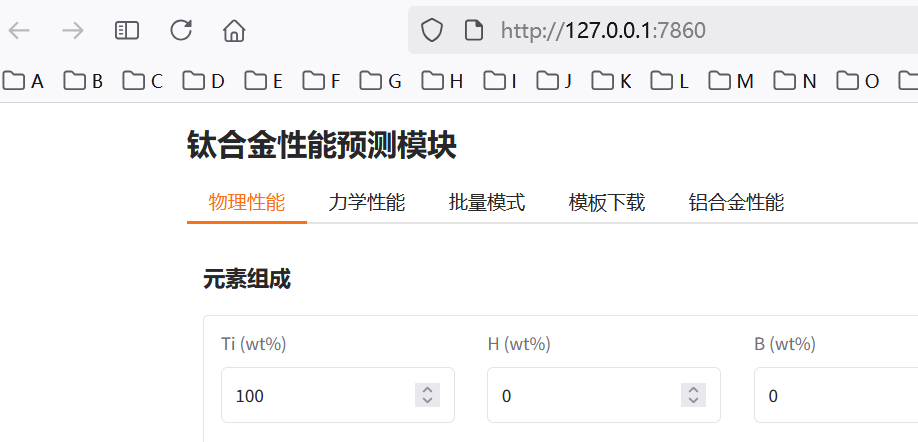
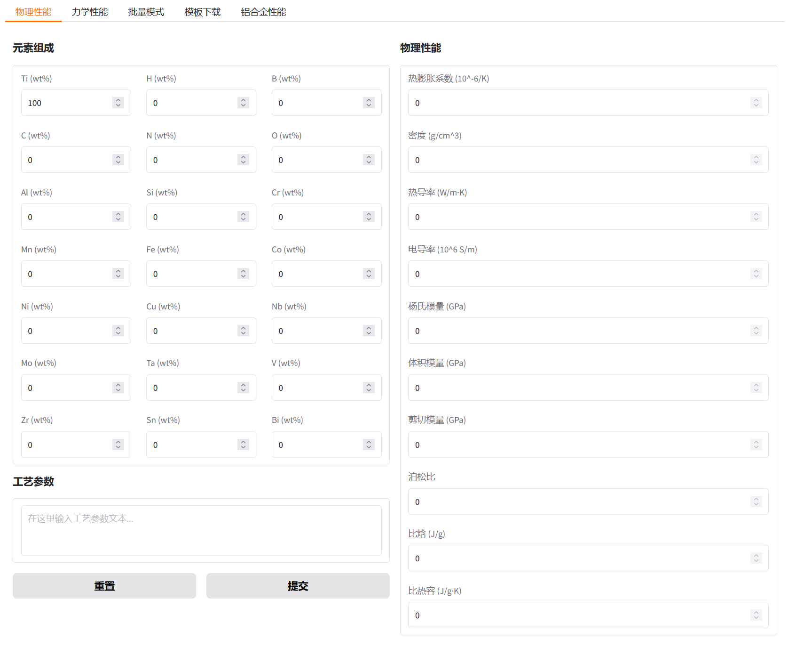
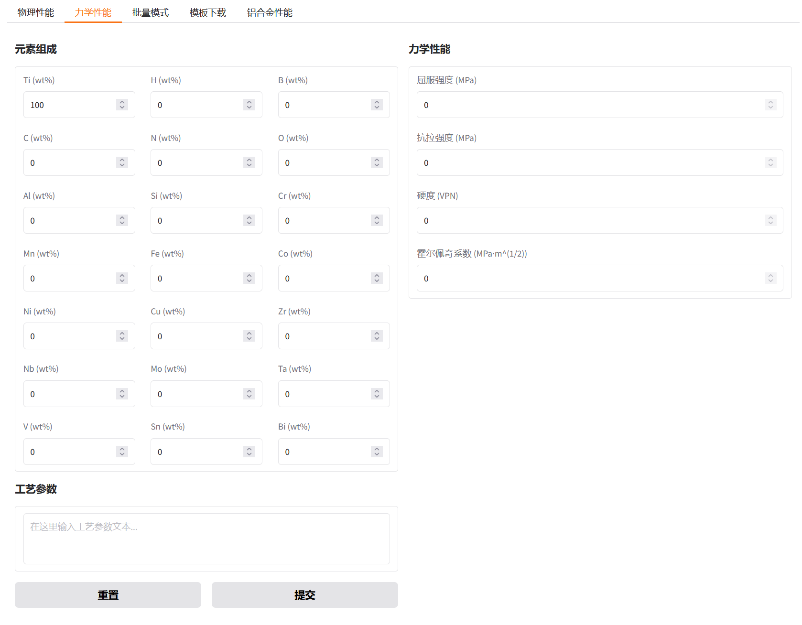
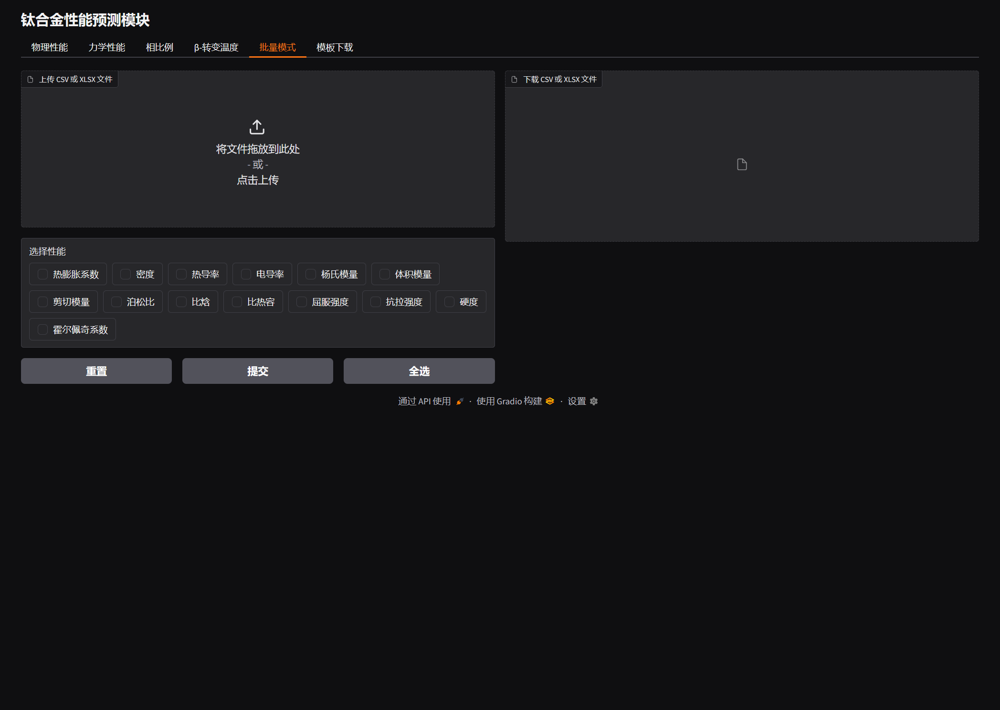
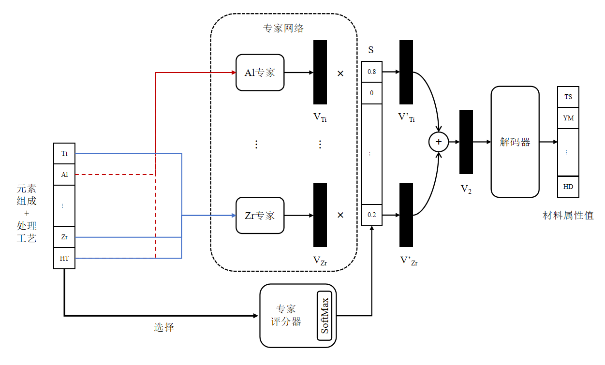

# 钛合金材料性能预测用户接口

## 一、用户指南

### 1.1 安装

安装 `tapp` 需要确保 `python>=3.10`，建议在新的虚拟环境中安装，避免软件包冲突。

```bash
# conda create -n tapp python=3.10
# conda activate tapp
pip install ./tapp-0.03-py3-none-any.whl
```

启动 `tapp` 十分简单，只需在终端中输入 `tapp` 或 `tap2` 命令，输出类似如下信息则表示启动成功，在浏览器中进入[输出的连接](http://127.0.0.1:7860)就可以使用 `tapp` 了。

```text
 _____     _     ____   ____  
|_   _|   / \   |  _ \ |  _ \ 
  | |    / _ \  | |_) || |_) |
  | |   / ___ \ |  __/ |  __/ 
  |_|  /_/   \_\|_|    |_|    
                              

Loading models: 100%|███████████████████████████████████████████████████████████████████████████████████████████████████████████████████████████████████████████████████| 14/14 [00:00<00:00, 27.86it/s]
* Running on local URL:  http://127.0.0.1:7860
* To create a public link, set `share=True` in `launch()`
```

### 2.2 使用

`tapp` 基于 [Gradio](https://www.gradio.app/) 框架构建，包括物理性能、力学性能、批量模式和模板下载四个模块，在网页版用户界面中通过选项卡进行模块切换。



- **物理性能** 

  在界面的左侧输入钛合金的元素组成和工艺参数，点击提交按钮，界面的右侧将显示由 `TAPP` 模型预测的物理性能。点击重置按钮可以清空全部输入和输出，将其恢复至默认值。元素组成支持：Ti、Al、Cr、Cu、Fe、Mo、Ni、Nb、Si、Sn、V、Zr、N、O、C、H、B，工艺参数支持：热处理温度，物理性能支持：热膨胀系数、密度、热导率、电导率、杨氏模量、体积模量、剪切模量、泊松比、比焓、比热容。
  
  

- **力学性能**
  
  在界面的左侧输入钛合金的元素组成和工艺参数，点击提交按钮，界面的右侧将显示由 `TAPP` 模型预测的力学性能。点击重置按钮可以清空全部输入和输出，将其恢复至默认值。元素组成支持：Ti、Al、Cr、Cu、Fe、Mo、Ni、Nb、Si、Sn、V、Zr、N、O、C、H、B，工艺参数支持：热处理温度，力学性能支持：屈服强度、抗拉强度、硬度、霍尔佩奇系数。
  
  
  
- **批量模式**
  
  在界面的上方上传包含钛合金元素组成和工艺参数的 CSV 或 XLSX 文件，并勾选需要计算的性能，点击提交按钮，界面的下方将输出批量计算的结果文件，点击下载即可。点击重置按钮可以清空全部的输入和输出文件。批量模式支持的元素组成、工艺参数、物理性能和力学性能与单点预测一致。**使用批量模式计算时，需确保上传的表格包含正确的头，否则可能有意外结果。模板下载模块中提供了 CSV 和 XLSX 两种格式的参考模板。** 有效的头包括：Ti、Al、Cr、Cu、Fe、Mo、Ni、Nb、Si、Sn、V、Zr、N、O、C、H、B、Heat Treatment Temperature。
  
  

## 二、性能预测算法

`tapp` 的性能预测使用了基于 `MoE` 的机器学习算法：建立若干个**元素专家**和一个**专家评分器**，元素专家接收Ti元素和对应元素的浓度作为输入，并输出预测的性能值，专家评分器则接收全部元素组成作为输入，输出对各个元素专家的评分，最后将各个元素专家给出的性能值和评分器给出的专家评分进行加权求和，得到最终的性能值。

该算法的好处是能够从元素角度捕捉数据的宏观和微观特征，元素专家能够计算出每种元素对于特定性能的贡献，而专家评分器能够平衡各元素的贡献程度。



## 三、属性值修正算法

### 3.1 强度修正算法

强度修正分为两个步骤：

1. 微量元素（`N`, `O`, `C`, `H`, `B`）修正：将微量元素的浓度和其对应系数相乘并求和，其中抗拉强度的增量为屈服强度增量的1.1倍。
   
   $$
   \Delta_{Yield\ Stress} = Wt(N) \times 2185.6 + Wt(O) \times 1219.86 + Wt(C) \times 704.2 + Wt(H) \times 268.0 - Wt(B) \times 34.0 \\
   $$

   $$
   \Delta_{Tensile\ Stress} = 1.1 \times \Delta_{Yield\ Stress}
   $$

2. 晶粒尺寸修正：机器学习模型计算的是晶粒尺寸为10微米的强度性能，利用霍尔-佩奇公式可得任意晶粒尺寸下的强度性能：
   
   $$
   \Delta_{Grain\ Size} = k_{Hall\ Petch} \times (d^{-\frac{1}{2}} - d_0^{-\frac{1}{2}})
   $$

### 3.2 物理性能修正算法

物理性能修正的增量是将每种主要元素（`Al`, `Cr`, `Cu`, `Fe`, `Mo`, `Nb`, `Ni`, `Si`, `Sn`）和微量元素（`C`, `N`, `O`, `B`, `H`）的组合与其对应系数相乘并求和：

$$
\Delta_{prop} = \sum_{e1, e2} Wt(e_1) \times Wt(e_2) \times k_{prop}(e_1, e_2)
$$

- $k_{Density}(·,·)$

  |   | Al           | Cr           | Cu           | Fe           | Mo           | Nb           | Ni           | Si           | Sn           |
  |---|--------------|--------------|--------------|--------------|--------------|--------------|--------------|--------------|--------------|
  | C | 0.001189364  | -0.033229803 | 0.006900622  | 0.001364253  | 0.001293301  | 0.001219326  | 0.001929503  | 0.001278101  | 0.001198975  |
  | N | 0.003211933  | -0.169015533 | 2.381598976  | 7.424964639  | 0.008192758  | 0.014823883  | 0.018094439  | 0.014480812  | 0.010925323  |
  | O | 0.01812761   | 0.021041677  | -0.266758591 | -1.897012602 | 0.026452594  | 0.026654634  | 0.010732661  | -5.104111794 | 0.025470266  |
  | B | 0.022893337  | 0.046100565  | 0.091790094  | 0.04476362   | 0.046677253  | 0.046287457  | 0.053434922  | 0.045513762  | -0.039840009 |
  | H | -4.922743468 | -4.406682541 | 1.499480452  | 15.85136756  | -4.284999468 | -4.414201642 | -4.482102982 | 45.9676752   | -4.531997149 |

- $k_{Thermal\ Conductivity}(·,·)$

  |   | Al           | Cr           | Cu           | Fe           | Mo           | Nb           | Ni           | Si           | Sn           |
  |---|--------------|--------------|--------------|--------------|--------------|--------------|--------------|--------------|--------------|
  | C | 0.011143497  | 3.489852516  | 0.050639097  | 0.045199609  | -0.006363126 | -0.146271765 | -0.036777042 | -0.032206222 | -0.035560762 |
  | N | 0.015501867  | 17.7350841   | 121.4258822  | 740.5704625  | -42.09685675 | -31.53882272 | -0.157892947 | 0.669169059  | -0.220360531 |
  | O | -7.111188519 | -13.84984689 | -13.80683762 | -81.18458214 | -17.8742612  | -16.63168331 | -8.830106909 | -19.40806548 | -7.758796868 |
  | B | -0.079181297 | -0.388880921 | 0.282376119  | -0.019358283 | -0.138847193 | -0.330954121 | -0.429841711 | -0.174089174 | -0.310205874 |
  | H | 174.2074784  | 127.8573     | 136.432501   | 752.5723302  | 446.2291183  | 495.3979761  | 25.63202273  | 153.3714961  | 9.850931867  |

- $k_{Electrical\ Conductivity}(·,·)$

  |   | Al           | Cr           | Cu           | Fe           | Mo           | Nb           | Ni           | Si           | Sn           |
  |---|--------------|--------------|--------------|--------------|--------------|--------------|--------------|--------------|--------------|
  | C | 427.4222959  | -1160.893555 | 1980.111753  | -1703.05578  | -355.9538164 | -5426.046231 | -1222.705087 | -1150.778254 | -1877.413688 |
  | N | 643.5254332  | 5716.60143   | -81371.57587 | 25064.0197   | 8744.494462  | 104164.2629  | -8668.288187 | 49621.93846  | -12487.60801 |
  | O | -354773.0809 | -356747.4198 | -343208.1088 | -242411.9374 | -329665.1045 | -391633.5205 | -409248.1142 | -364784.2755 | -387130.4589 |
  | B | -18421.64249 | -22875.26649 | 13480.95763  | -15435.74515 | -7469.583248 | -18476.56392 | -25040.42194 | -8473.574668 | -22231.51572 |
  | H | 454916.494   | 900699.6168  | 767781.0268  | 368418.7209  | 855436.335   | 583596.1172  | 649707.8811  | 263225.8889  | 558257.5577  |

- $k_{Young's\ Modulus}(·,·)$

  |   | Al           | Cr           | Cu           | Fe           | Mo           | Nb           | Ni           | Si           | Sn           |
  |---|--------------|--------------|--------------|--------------|--------------|--------------|--------------|--------------|--------------|
  | C | 2.687507505  | 6.928988486  | 2.760425827  | 2.882769734  | 2.856143054  | 2.851864857  | 2.894755453  | 2.802196795  | 2.409429476  |
  | N | 4.494867834  | 25.77829052  | -71.10355102 | 569.8110626  | -86.32504336 | 3.873705269  | 18.0498347   | 17.3860172   | 17.07487544  |
  | O | 6.683187786  | 3.724882158  | 8.733050146  | -55.0048898  | -19.64440386 | 3.999887499  | 7.763206322  | -6.288934614 | 7.191511269  |
  | B | 2.396641297  | -0.075441769 | -5.220427127 | -1.981547993 | -3.917721649 | -4.955526404 | -5.294481326 | -4.770403738 | -2.979347874 |
  | H | -92.63189837 | 175.7924499  | 83.62668492  | 717.1182946  | 957.9610359  | 228.6389485  | 111.8343005  | 251.9310226  | 108.5756246  |

- $k_{Bulk\ Modulus}(·,·)$

  |   | Al           | Cr           | Cu           | Fe           | Mo           | Nb           | Ni           | Si           | Sn           |
  |---|--------------|--------------|--------------|--------------|--------------|--------------|--------------|--------------|--------------|
  | C | 1.91143643   | 4.782574079  | 2.011642041  | 2.116353667  | 2.107925979  | 2.074354268  | 2.120185848  | 2.053483553  | 1.75353913   |
  | N | 3.209269193  | 17.46569617  | -61.61676964 | 228.7679945  | -67.88536    | -0.822162564 | 13.29738451  | 13.00498378  | 12.55234131  |
  | O | -4.87225487  | -7.610587176 | -2.889906738 | -30.13159105 | -24.46797818 | -7.585980355 | -4.258953485 | -12.81924464 | -4.258542434 |
  | B | -2.946153806 | -12.61637001 | -12.91788374 | -10.19348451 | -11.42129274 | -12.41581323 | -13.18642973 | -12.09212666 | -9.908171743 |
  | H | 85.02240782  | 330.0399644  | 242.651319   | 450.5155243  | 930.2098776  | 410.4772374  | 277.1712212  | 360.7586372  | 266.617343   |

- $k_{Sheer\ Modulus}(·,·)$

  |   | Al           | Cr          | Cu           | Fe           | Mo           | Nb           | Ni           | Si           | Sn           |
  |---|--------------|-------------|--------------|--------------|--------------|--------------|--------------|--------------|--------------|
  | C | 1.051068564  | 2.718633112 | 1.077060841  | 1.122686991  | 1.112773606  | 1.113072282  | 1.128919511  | 1.092907451  | 0.940211602  |
  | N | 1.757030104  | 10.13190287 | -27.17580326 | 232.6984397  | -33.38916671 | 1.722337109  | 7.034259775  | 6.764044231  | 6.655379931  |
  | O | 3.172669662  | 2.062887355 | 3.950813852  | -22.0090355  | -7.071173486 | 2.177602179  | 3.612231287  | -1.969884481 | 3.362529131  |
  | B | 1.203795098  | -1.44761456 | -1.510643413 | -0.286721245 | -1.035560908 | -1.423615668 | -1.526187408 | -1.363322081 | -0.716049713 |
  | H | -45.03878237 | 56.66865752 | 21.94369734  | 283.6583886  | 360.2530288  | 74.92434101  | 32.11387735  | 87.88767559  | 31.35851808  |

- $k_{Poisson\ Ratio}(·,·)$

  |   | Al           | Cr           | Cu           | Fe           | Mo           | Nb           | Ni           | Si           | Sn           |
  |---|--------------|--------------|--------------|--------------|--------------|--------------|--------------|--------------|--------------|
  | C | 0.253272904  | -0.002701381 | -0.000889767 | -0.000978328 | -0.000909902 | -0.00092762  | -0.0009085   | -0.00086636  | -0.000786759 |
  | N | -0.001525558 | -0.010709855 | 0.002303789  | -0.522062551 | 0.020209486  | -0.007743567 | -0.00557927  | -0.005084367 | -0.005387734 |
  | O | -0.018617133 | -0.019438832 | -0.019382127 | 0.036048333  | -0.012011115 | -0.020208344 | -0.020199332 | -0.012779452 | -0.019385532 |
  | B | -0.008751755 | -0.014158427 | -0.014496842 | -0.0148      | -0.0144      | -0.0142      | -0.014842884 | -0.013871117 | -0.012828261 |
  | H | 0.295234945  | 0.307906363  | 0.304070677  | -0.36820265  | 0.096743287  | 0.369543766  | 0.319818328  | 0.242612884  | 0.307072298  |
